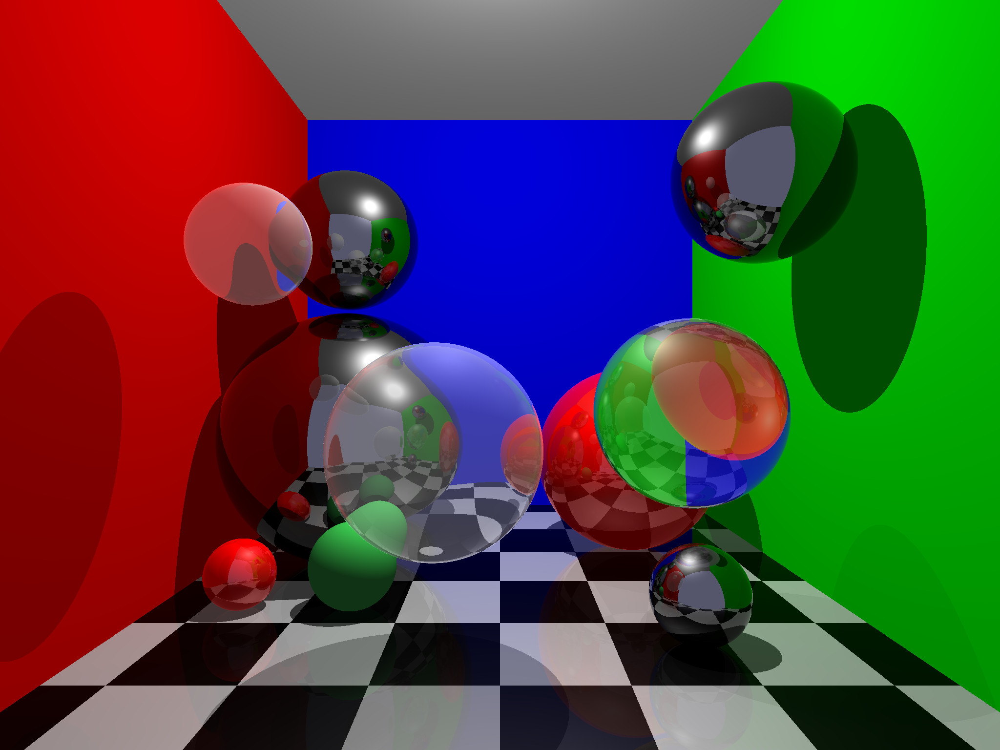

# ray-tracer

Ray tracer scene renderer created entirely with C++
* *designed for unix-like operating systems*
* *written in c++11*
* *uses g++ compiler*
## Contents

1. [**Sample Scene**](#sample-scene)
2. [**Capabilities**](#capabilities)
3. [**Build Instructions**](#build)
4. [**Viewing the output**](#viewing-the-output)
5. [**Scene Description File**](#scene-description-file)
6. [**Program Structure**](#program-structure)
7. [**Mathematics**](#mathematics)

## Sample scene

## Capabilities
* Render a scene from a [scene description file](#scene-description-file)
* spheres and triangles
* transparent and opaque objects
* reflective objects
* textured objects

## Build

#### Clone the repository

    git clone https://github.com/mbjenson/ray-tracer.git
#### compile
compiled binary executable located in the project's home directory
    
    make
#### Run
Running the executable with a [scene description file](#scene-description-file) will create an ascii ppm (.ppm) containing the rendered image under the same basename as the input file. The output file is located in the same directory as the input file. If a ppm file with that name already exists there, it will be overridden.

To run the executable with an input file, use the following command

    ./raytracer path/to/scenedescriptionfile.txt
*note: rendering the sample scene description file will take between 10 and 30 seconds (depending on your CPU speed) because of the high resolution of the image. So don't worry if it seems frozen :).*

## Viewing the output
Ascii ppm is not a typical image format and as a result, requires additional software to be viewed. I recommend using GIMP (GNU image manipulation program) which is a free and open source image editor like photo-shop. GIMP can be installed from the [GIMP website](https://www.gimp.org/) or downloaded from a linux terminal using

    sudo apt install gimp
## Scene Description File
*see [sample scene](https://github.com/mbjenson/ray-tracer/blob/main/sample_scene/t4.txt) for a description file example. The rendered scene is displayed [above](#sample-scene) or can be viewed [here](https://github.com/mbjenson/ray-tracer/blob/main/sample_scene/t4.jpg)*
### Formatting
The description file is a text file containing information that tells the ray tracer what to draw, where to draw it, what color it is, etc. Each line starts with a keyword and is followed by some value(s) or argument(s). This can be seen just below when defining the image size. There, the word 'imsize' is the keyword and it is followed by two numerical values.
### Scene Settup
Every scene file needs to include the following information to settup the scene:

**image size**: two ints which define image dimensions in pixels

    'imsize width height'
**eye position**: 3D float vector

    'eye x y z'
**viewing direction vector**: 3D float vector

    'viewdir x y z'
**up direction**: 3D float vector

    'updir x y z'
**vertical field of view**: positive float

    'vfov x'
**background scene color**: 4D positive floats

    'bkgcol r g b η'
where the η (eta) allows the user to specify a density-surround that the camera is emerssed in. (eg. water)

### Shapes, Materials, Lights, and Textures

**Textures**
The textures used in the ray tracer must be in ascii ppm format and are declared as follows

    'texture path/to/texture.ppm file'

**Materials**
objects use the last defined material they are listed under in the file.

        'mtlcol r g b specular_r specular_g specular_b ambient_weight diffuse_weight specular_weight specular_falloff alpha index_of_refraction'      
* r, g, b : intrisic object color (0 to 1)
* specular_r, specular_g, specular_b : color of specular reflection (0 to 1)
* ambient_weight : intensity of color without light (0 to 1)
* diffuse_weight : intensity of color when in light (0 to 1)
* specular_weight : intensity of specular reflection (0 to 1; if > 0, object will show reflections)
* specular_falloff : controls the weight of how large the area of specular reflection is (>= 0)
* alpha : controls the transparency of the material (0 to 1)
* index_of_refraction : how much a ray is bent upon entry into the object (> 0)

**Lights**
The program supports both directional and point lights

    'light x y z light_type r g b'
* light_type : 0 = directional light, 1 = point light
* x, y, z : 3D float vector defining light position for point lights and light direction for directional lights
* r, g, b : light color

**Spheres**

    'sphere x_center y_center z_center radius'
all values are floats

**Faces (triangles)**

Faces have several options and components

verticies : declared in the file and, upon execution, are stored in an array. These verticies are referenced later when defining faces. 3D float vector

    'v x y z'
vertex normals : a vertex can have a corresponding normal direction associated with it. this allows for smoothly shaded triangles. 3D float vector

    'vn x y z'
texture coordinates : a vertex can have a corresponding texture coordinate assocated with it which corresponds to where a texture is positioned in reference to that vertex. values (0 - 1)

    'vt u v'

faces : combination of 3 verticies which have been previously declared in the file. vertices are references in order of declaration in the file starting at 1.

    
    'f v1 v2 v3'
faces with vertex normals : include a vertex normal for every vertex

    'f v1//vn1 v2//vn2 v3//vn3'
faces with texture coordinates : include a texture coordinate for each vertex

    'f v1/vt1 v2/vt2 v3/vt3'
faces with both texture coordinates and vertex normals

    'f v1/vt1/vn1 v2/vt2/vn2 v3/vt3/vn3'
## Program Structure
The header files contain extensive documentation. More specific implementation documentation can be found in the cpp files.

## Mathematics
Lighting is calculated with an extended version of the blinn-phong illumination equation.
